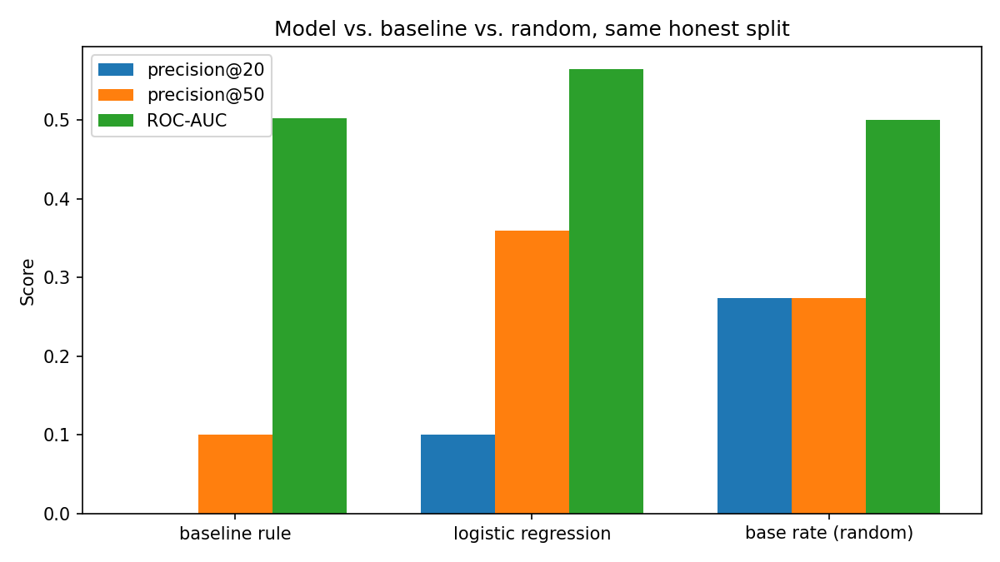
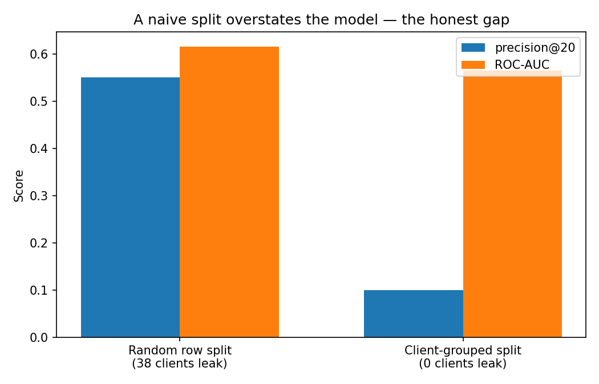
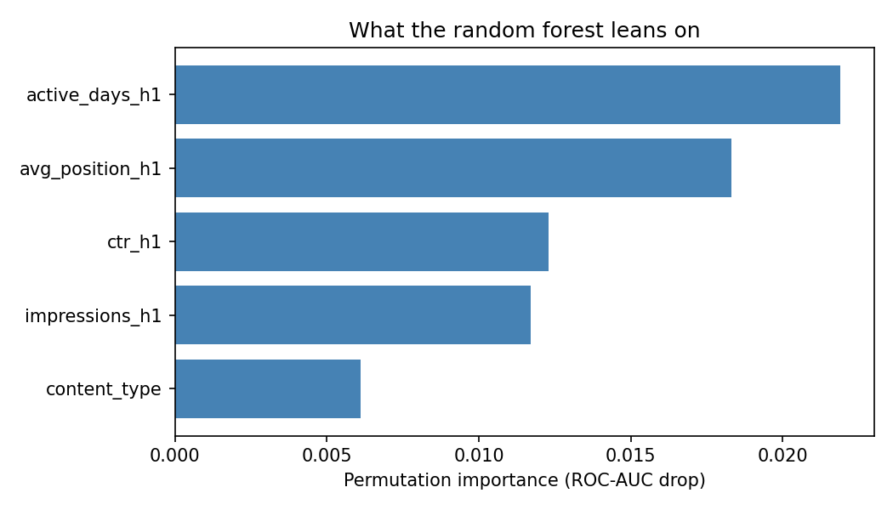
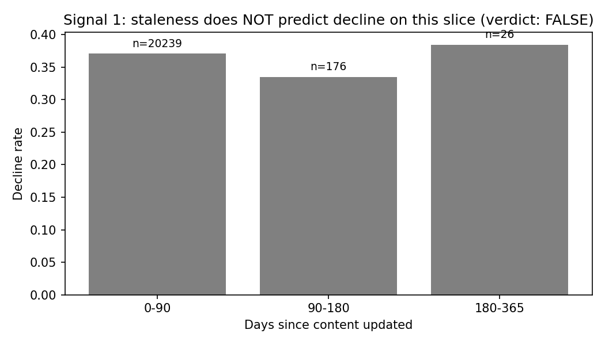
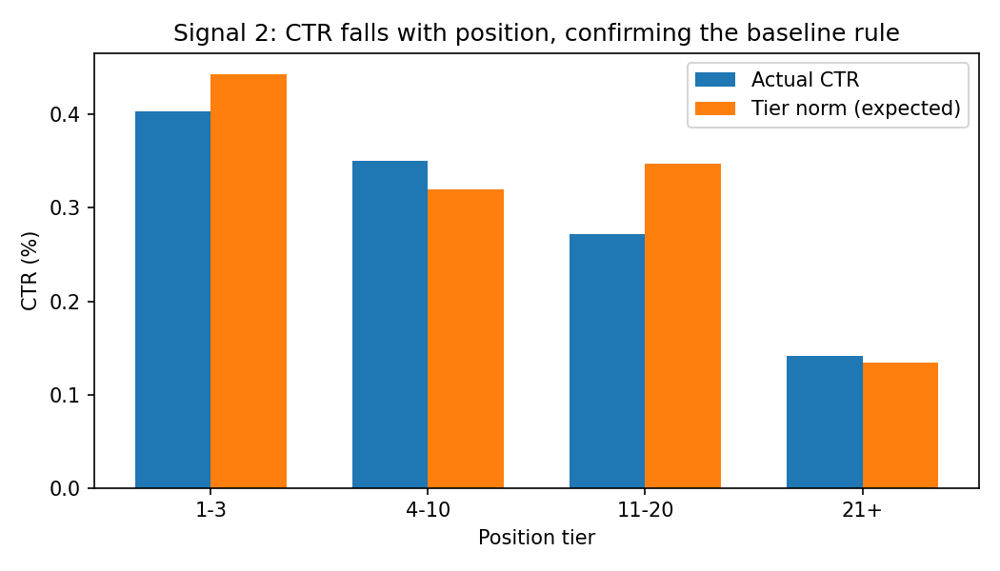
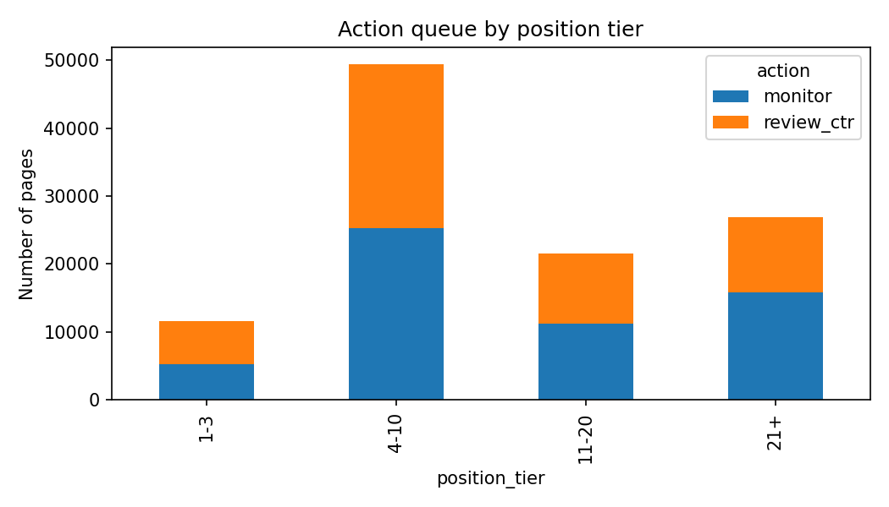

# Capstone Report — Refresh / Content Opportunity Scoring

- **Author:** Muhammad Sheheryar Khan
- **Lane:** Refresh / Content Opportunity Scoring (Lane 2)
- **Repo:** https://github.com/M-Sheheryar-khan/FlyRank-ML-Internship-Starter-Repo
- **Date:** August 2026

> **Headline result:** On a client-held-out split, a learned model beat both the hand-written baseline rule and random ranking at precision@50 (0.36 vs a 0.274 base rate) — but a naive random split had overstated that same model's performance (ROC-AUC 0.616 vs an honest 0.565), because clients leaked across train and test. That gap is the project's core finding.

## 0. Abstract

Content teams with limited review time need to know which pages to check first. This project
asks whether historical search performance signals — traffic, position, and click-through
rate — can rank content pages by how urgently they deserve review. Using one mid-panel month
(March 2026) of FlyRank's search-console warehouse data (109,592 content pages across dozens
of clients), I built a transparent baseline rule (pages with real visibility but a click rate
below their position tier's norm) and compared it against logistic regression and random
forest models, all validated on a client-held-out split so no client's pages appeared in both
training and test data. On that honest split, the learned models showed real but modest lift
over the baseline and over random ranking at precision@50 (0.36 vs a 0.274 base rate), while
none of the three methods reliably identified the single riskiest 20 pages
(precision@20 below the base rate for all three). The output is a decision-support ranked
queue with reason codes, meant to help a human reviewer triage — not a causal claim that any
specific fix will work.

## 1. Problem framing

**Decision:** which content pages should a team review first when review capacity is limited.
**Unit of analysis:** one content page (`content_hash_id`), aggregated over a 15-day feature
window and scored against a 15-day outcome window, within one client's portfolio.
**Output:** a ranked queue with a numeric score, one reason code, and an action label
(`review_ctr` or `monitor`).
**Action a human takes:** open the flagged page, check whether the click-rate gap reflects a
real snippet/title problem or a benign explanation (query intent, a SERP feature capturing
clicks, tracking noise), then decide whether to edit it.
**Cost of a wrong call:** reviewing a page with no real problem wastes reviewer time; missing a
genuinely underperforming page means lost clicks and, over time, lost rank. Neither error is
catastrophic on its own, which is exactly why this is a *prioritization* tool, not an
automated-action tool.
**Why ML/data helps:** a fixed if-statement rule can check one or two conditions; the actual
question — is this page's click rate low *for its position*, given its traffic — needs a
position-relative baseline that a hand-tuned single threshold can't express as cleanly, and a
learned model can additionally weigh interactions (e.g. low CTR *combined with* few active
days) that a simple rule ignores.

## 2. Data safety

**Source:** FlyRank internship warehouse (Hugging Face, `hf://datasets/FlyRank/internship-warehouse`),
`fact_content_daily_performance` table, `month=2026-03` partition — a mid-panel month, not the
sealed final month (`fact_content_daily_performance_sample`), to avoid developing inside my own
future test window. Joined to `dim_content` for content type and update date.
**Size:** 109,592 content pages with ≥20 impressions in the first 15 days of March, across
dozens of pseudonymized clients.
**Time windows:** features from days 1–15 of March 2026 (`_h1`); the label compares against
impressions in days 16–31 (`_h2`) — strictly later, no overlap.
**Excluded, and why:**
- `trend_direction` / `trend_pct` — label-derived, per the internship's data guide; never used
  as features.
- `health_score`, `priority_score`, `action_type`, refresh flags — FlyRank's own product
  decisions are not present in this dataset at all, so there was nothing to accidentally
  include.
- `fact_content_query_90d` — its 90-day window overlaps the label window in ways I didn't have
  time to align correctly this cycle; left out rather than risk silent leakage.
- Staleness / `days_since_update` — tested directly (see Section 6) and found not usable on
  this slice; dropped from the final rule and features.
**Identifiers:** `content_hash_id` and `client_hash_id` are pseudonyms, used only for joining
and for grouped train/test splitting — never as features. No client names, URLs, or raw
queries appear anywhere in this repo.

## 3. Baseline

**The rule, in plain words:** a page is worth reviewing if it gets real search visibility
(≥100 impressions in the 15-day window) but its click-through rate is below what pages at its
own position tier normally get. Score = `impressions_h1 × (expected_ctr − ctr_h1)`, where
`expected_ctr` is the weighted CTR for that page's position tier, computed from **training
rows only** (a leakage fix made in Week 6 — see Section 6).

**Why it's a fair comparison:** it uses only the two signals the signal audit actually
confirmed (see Section 6), computed the same way, on the same rows, that the models later use.

**Numbers:** of 109,592 pages, 52,029 (47.5%) were flagged `review_ctr`. Overall base rate for
the "declining" label was 0.291. On the baseline rule alone (evaluated on the client-held-out
test split): precision@20 = 0.000, precision@50 = 0.100, ROC-AUC = 0.502 — indistinguishable
from random at the ROC-AUC level, though it does concentrate real traffic value at the top of
its own ranking by construction.

## 4. Model / analysis

**Method:** Logistic Regression, then Random Forest — both a natural fit for a binary,
observed label (`is_declining`), per the "yes/no with an observed label" guidance from this
week's toolkit. Random Forest was included to check whether interactions between signals (e.g.
low CTR *and* few active days) add real lift over a linear model.

**Target/proxy, one sentence:** `is_declining = 1` if a page's impressions in the second half
of March (days 16–31) fell below 80% of its first-half impressions (days 1–15) — an observed,
same-month proxy for decline, not a validated long-term outcome.

**Features used:** `impressions_h1`, `clicks_h1`, `avg_position_h1`, `active_days_h1`,
`ctr_h1`, and `content_type` (one-hot encoded). Deliberately excluded the baseline's own
`baseline_score` from the model's inputs — feeding the model the baseline's output would let it
imitate the rule instead of discovering anything independently.

## 5. Evaluation

**Split:** grouped by `client_hash_id` (75/25, `GroupShuffleSplit`, `random_state=42`) — no
client's pages appear in both train and test, because pages from the same client share
editorial style and template effects that a random row split would let a model memorize.

**Model vs. baseline, same split, same metrics:**

| Method | precision@20 | precision@50 | ROC-AUC |
|---|---:|---:|---:|
| baseline rule | 0.000 | 0.100 | 0.502 |
| logistic regression | 0.100 | 0.360 | 0.565 |
| base rate (random ranking) | 0.274 | 0.274 | 0.500 |

*The learned model clears the baseline and random ranking at precision@50, but none of the three beat random at precision@20 — the top of the ranking isn't where the real lift shows up.*

*The naive random split (left) reports a higher precision@20 and ROC-AUC than the honest client-grouped split (right) — because 38 clients leaked across train and test in the random version. The gap between the two bars is the size of that leakage effect.*

*The `review_ctr` queue concentrates in the 4-10 and 21+ position tiers, where the CTR gap against each tier's own norm is largest.*

**What the errors look like:** the three highest-confidence wrong predictions were all
low-volume pages (34–68 impressions over 15 days), ranking poorly (position 28–41), with
literally zero clicks in the feature window — the model scored each around 3% decline-risk, but
all three actually declined. These sit right at the `impressions_h1 ≥ 20` inclusion cutoff,
where the label itself is noisiest (a single slow day can flip the 0.8× threshold either way).

**Feature importance** (permutation importance, random forest): `active_days_h1` (0.022),
`avg_position_h1` (0.018), `ctr_h1` (0.012), `impressions_h1` (0.012), `content_type` (0.006).
None towers over the rest the way a leaked feature would — a mild spread across several
plausible signals, not a single suspiciously perfect predictor.

*No single feature dominates — importance spreads across several plausible signals rather than concentrating on one, which is what you'd want to see if nothing leaked in.*

## 6. Interpretation

**Signal audit (Week 4), stated plainly:**
- **Staleness verdict: FALSE.** Among the 20,441 pages with a valid update date, 99% (20,239)
  had been updated within the last 90 days; decline rate did not rise with staleness
  (37.1% → 33.5% → 38.5% across the three age buckets), and the oldest bucket had only 26
  rows. Staleness is not a usable signal on this slice and was dropped from the rule.

  

*Decline rate barely moves across staleness buckets, and the oldest bucket has only 26 pages — not enough to trust even if the pattern looked cleaner. This is what a negative result looks like: honestly shown, not hidden.*

- **CTR-vs-position verdict: CONFIRMED.** Weighted CTR fell from 0.449% (position 1–3) to
  0.328–0.337% (position 4–20) to 0.135% (21+), across large buckets (n = 11,583 / 49,444 /
  21,597 / 26,958). This is the signal the baseline rule is built on.

  

*Actual CTR tracks closely with the tier norm for most pages, which is exactly why the gap — when it does appear — is a meaningful signal rather than noise.*

**The validation-design finding (Week 6), which is arguably the most important result in this
project:** the same model, evaluated on a naive random row split instead of a client-grouped
split, reported precision@20 = 0.55 and ROC-AUC = 0.616 — because 38 clients appeared in both
its train and test sets, letting it partly memorize client-specific patterns. On the honest,
client-held-out split, those numbers dropped to precision@20 = 0.10 and ROC-AUC = 0.565. The
gap between 0.616 and 0.565 is itself the finding: it is the size of the memorization effect a
less careful validation design would have hidden.

**Refresh/decay finding, contrasted honestly with FlyRank's own broader research:** FlyRank's
March 2026 portfolio research paper finds refresh timing to be one of its strongest
portfolio-wide levers (365+ day pages refreshed within 30 days show a 3.2x health-score boost
and 57x more impressions, across their much larger 341,701-page portfolio). My own signal audit
on this narrower one-month, ~110K-row slice did **not** confirm that pattern — there simply
wasn't enough stale content in this slice to test the claim (only 26 pages older than 180 days
with a valid update date). This is not a contradiction of FlyRank's finding; it's a scope
limit of this project's data, and the final rule leans on the CTR signal instead, which did
confirm here.

## 7. Recommendation

**Ranked action queue** (full detail in `work/outputs/action_playbook_queue.csv`, regenerated
by `work/notebooks/w07_action_playbook.ipynb`): pages are flagged `review_ctr` when they carry
real traffic but underperform their position tier's expected click rate, with priority set by
`impressions × ctr_gap`. All other pages are `monitor`.

*The `review_ctr` queue concentrates in the 4-10 and 21+ position tiers, where the CTR gap against each tier's own norm is largest.*

**How a FlyRank editor would use this tomorrow:** open the top of the `review_ctr` queue,
check query intent and whether a SERP feature is capturing clicks before editing anything, then
prioritize snippet/title work on pages where the position tier is 1–3 or 4–10 (where FlyRank's
own portfolio research shows click capture is worth the most per impression).

**What should never be automated from this output:** auto-rewriting page content or
titles, auto-publishing/unpublishing pages, treating `monitor` as a clean bill of health
without periodic re-check, or any bulk pruning decision — none of these actions were validated
by this project.

**Confidence and limits, stated plainly:** this is decision-support evidence from one
15-day/15-day window in one month, on a client-held-out split. It shows the flagged pages carry
real, if modest, signal in aggregate (precision@50 clears the base rate); it does not
reliably identify the single riskiest handful of pages, and it makes no causal claim that
editing a flagged page will improve its performance.

## 8. Reproducibility

All notebooks are in `work/notebooks/`, run top to bottom, seeds fixed at `random_state=42`
throughout (train/test splits, logistic regression, random forest, permutation importance).
Sequence: `w01_research_question.ipynb` → `w02_ml_task_framing.ipynb` →
`w03_data_contract.ipynb` → `w04_baseline_score.ipynb` → `w05_model.ipynb` →
`w06_validation_audit.ipynb` → `w07_action_playbook.ipynb`. Metrics receipts committed at
`work/outputs/playbook_metrics.json`; figure at `work/figures/action_by_position_tier.png`.
To rerun: clone the repo, open any notebook in Colab, add a Hugging Face read token as the
Colab secret `HF_TOKEN` (gated dataset access, instant approval), Runtime → Run all.

## 9. Acknowledgments & data credit

Built on the FlyRank ML Internship dataset — [flyrank.ai](https://flyrank.ai).
